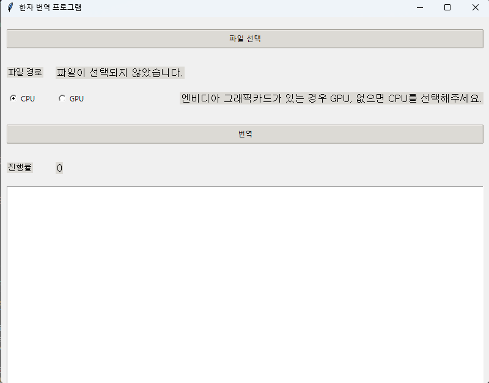
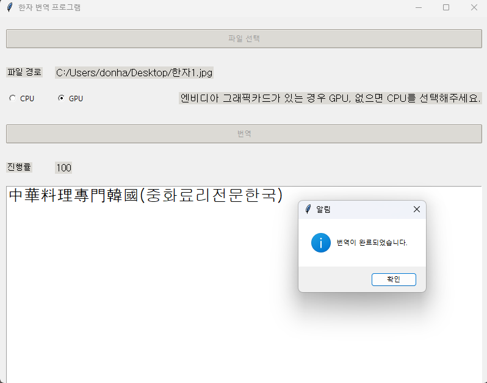
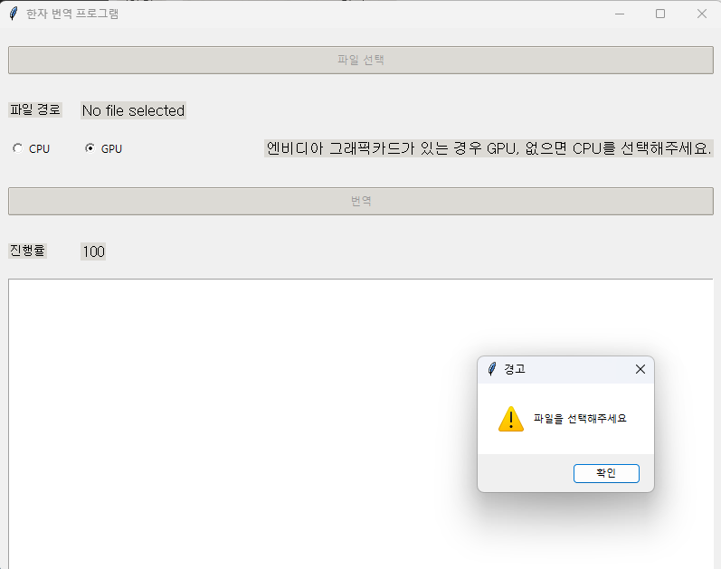

# hanja_hangeul_translation

## 설명
* 한자, 영어의 경우 인식이 잘 되나 easyocr 자체가 한자, 한국어를 같이 사용할 수 없어서 중국어 번체(대만, 한국 한자), 영어만 인식하도록 설정했다. 나머지 언어는 작동할경우 이상하게 인식된다.

### 실행파일
* runfile > dist > main.exe

## 결과
### 메인


### 번역


### 이미지 선택 안한경우


## 개발자
sedoll <br>
[naverBlog](https://blog.naver.com/tmvmffpsej) <br>
[velog](https://velog.io/@sedo11/posts) <br>

## devlop
python 3.8.10 <br>
tkinter <br>
easyocr <br>
hanja <br>

## reference
[한자 한글 번역 라이브러리](https://github.com/suminb/hanja) <br>
[ocr 라이브러리](https://github.com/JaidedAI/EasyOCR?tab=readme-ov-file) <br>

## 문제점

### 중국어와 한국어가 함께 인식이 안되는 이유
* 내부 모듈 코드를 확인해보니 reader 부분에서 모델을 선택할 때 한, 중, 일 그리고 몇몇 언어는 영어랑만 대응되게 코드가 짜있어서 안된다.

```python
# easyocr.py 코드 일부분
# choose recognition model
if lang_list == ['en']:
    self.setModelLanguage('english', lang_list, ['en'], '["en"]')
    model = recognition_models['gen2']['english_g2']
    recog_network = 'generation2'
elif 'th' in lang_list:
    self.setModelLanguage('thai', lang_list, ['th','en'], '["th","en"]')
    model = recognition_models['gen1']['thai_g1']
    recog_network = 'generation1'
elif 'ch_tra' in lang_list:
    self.setModelLanguage('chinese_tra', lang_list, ['ch_tra','en'], '["ch_tra","en"]')
    model = recognition_models['gen1']['zh_tra_g1']
    recog_network = 'generation1'
elif 'ch_sim' in lang_list:
    self.setModelLanguage('chinese_sim', lang_list, ['ch_sim','en'], '["ch_sim","en"]')
    model = recognition_models['gen2']['zh_sim_g2']
    recog_network = 'generation2'
elif 'ja' in lang_list:
    self.setModelLanguage('japanese', lang_list, ['ja','en'], '["ja","en"]')
    model = recognition_models['gen2']['japanese_g2']
    recog_network = 'generation2'
elif 'ko' in lang_list:
    self.setModelLanguage('korean', lang_list, ['ko','en'], '["ko","en"]')
    model = recognition_models['gen2']['korean_g2']
    recog_network = 'generation2'
elif 'ta' in lang_list:
    self.setModelLanguage('tamil', lang_list, ['ta','en'], '["ta","en"]')
    model = recognition_models['gen1']['tamil_g1']
    recog_network = 'generation1'
elif 'te' in lang_list:
    self.setModelLanguage('telugu', lang_list, ['te','en'], '["te","en"]')
    model = recognition_models['gen2']['telugu_g2']
    recog_network = 'generation2'
elif 'kn' in lang_list:
    self.setModelLanguage('kannada', lang_list, ['kn','en'], '["kn","en"]')
    model = recognition_models['gen2']['kannada_g2']
    recog_network = 'generation2'
elif set(lang_list) & set(bengali_lang_list):
    self.setModelLanguage('bengali', lang_list, bengali_lang_list+['en'], '["bn","as","en"]')
    model = recognition_models['gen1']['bengali_g1']
    recog_network = 'generation1'
elif set(lang_list) & set(arabic_lang_list):
    self.setModelLanguage('arabic', lang_list, arabic_lang_list+['en'], '["ar","fa","ur","ug","en"]')
    model = recognition_models['gen1']['arabic_g1']
    recog_network = 'generation1'
elif set(lang_list) & set(devanagari_lang_list):
    self.setModelLanguage('devanagari', lang_list, devanagari_lang_list+['en'], '["hi","mr","ne","en"]')
    model = recognition_models['gen1']['devanagari_g1']
    recog_network = 'generation1'
elif set(lang_list) & set(cyrillic_lang_list):
    self.setModelLanguage('cyrillic', lang_list, cyrillic_lang_list+['en'],
                            '["ru","rs_cyrillic","be","bg","uk","mn","en"]')
    model = recognition_models['gen2']['cyrillic_g2']
    recog_network = 'generation2'
else:
    self.model_lang = 'latin'
    model = recognition_models['gen2']['latin_g2']
    recog_network = 'generation2'
```

## error, bug

### hanja library _impl error
```
pip install hanja
``` 
<br>

* 해당 코드를 이용해 설치를 하고 실행을 하면 해당 라이브러리에서 impl이 없다는 오류가 발생하는데 해당 오류를 해결하려면 해당 [링크](https://github.com/suminb/hanja/releases)에서 파일을 다운로드 한 후 해당 라이브러리가 설치된 경로에 파일을 복붙해서 넣어주면 실행된다.

pip package 설치 경로

```
C:\Users\{사용자이름}\AppData\Local\Programs\Python\Python38\Lib\site-packages\hanja
```
